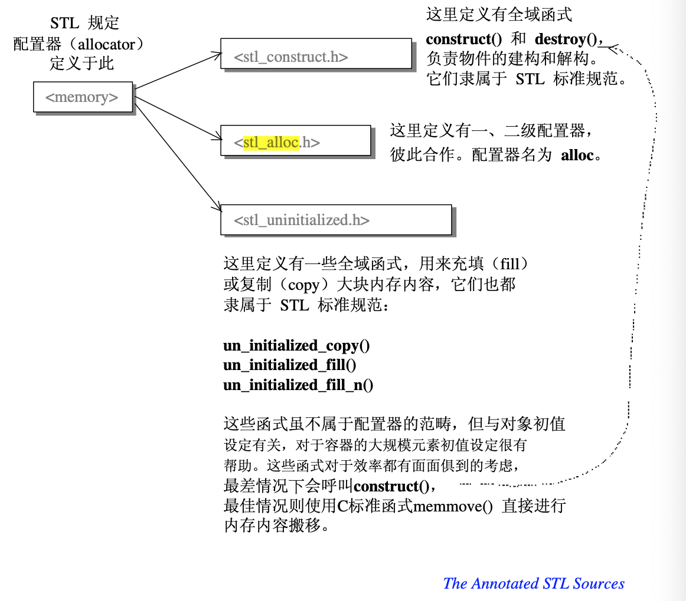
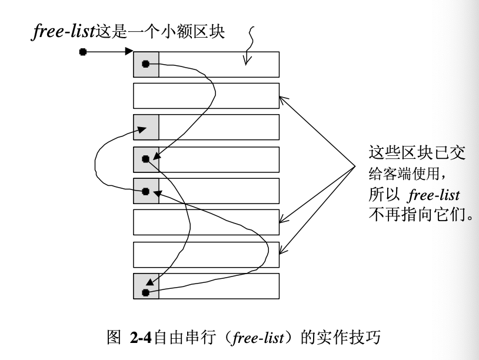

## 配置器(allocator)



配置器：负责空间配置与管理，从实现的角度来看，配置器是一个实现了动态空间配置、空间管理、空间释放的 class template。

空间配置器：整个 STL 的操作对象(所有的数值)都存放在容器之内，而容器一定需要配置空间以存放内容。


## 具有次配置力(sub-allocation)的 SGI 空间配置器

### SGI STL 空间配置器的结构

SGI STL 的配置器，其名称是 alloc 而不是 allocator，而且不接受任何参数。

SGI STL 的每一个容器都已经指定其缺省的空间配置器为 alloc。

\(实际上STL 里面的容器其本上都指定了默认` Alloc = allocator<T>`\)

```cpp
template <class T, class Alloc = alloc>  // 缺省使用 alloc 为配置器
class vector {...};

vector<int, std::alloc> iv; 
```

* <defalloc.h>----SGI 标准的空间配置器，std::allocator

  allocator 只是基层内存配置/释放行为(::operator::new 和 ::operator::delete)的一层薄薄的包装，并没有考虑到任何效率上的强化。

* SGI 特殊的空间配置器，std::alloc

  + <stl_construct.h>：定义了全局函数 construct() 和 destroy()，负责对象的构造和析构。 
  + <stl_alloc.h>：定义了一、二级配置器，配置器名为 alloc。
  + <stl_uninitialized.h>：定义了全局函数，用来填充(fill)或复制(copy)大块内存数据。

* 构造和析构基本工具

  具体看 <stl_construct.h> 源码，功能是构造和析构操作。

* 空间的配置和释放，std::alloc
  + 向 system heap 要求空间
  + 考虑多线程(multi-threads)状态
  + 考虑内存不足时的应变措施
  + 考虑过多 “小型区块” 可能造成的内存碎片问题

  对象构造前的空间配置 和 对象析构后的空间释放，具体看 <stl_alloc.h>。

### SGI STL 空间配置器的分析

考虑到小型区块可能造成内存碎片问题，SGI 采用两级配置器，第一级配置器直接使用 malloc() 和 free() 实现；第二级配置器使用 memory pool 内存池管理。

第二级配置器的原理：

* 当配置区块超过 128 bytes，就使用第一级配置器
* 当配置区块小于 128 bytes，使用内存池管理

```c
enum {_ALIGN = 8};  // 小型区块的上调边界
enum {_MAX_BYTES = 128}; // 小区区块的上限
enum {_NFREELISTS = 16}; // _MAX_BYTES/_ALIGN  free-list 的个数

// free-list 的节点结构，降低维护链表 list 带来的额外负担
union _Obj {
    union _Obj* _M_free_list_link;  // 利用联合体特点
    char _M_client_data[1];    /* The client sees this. */
};
static _Obj* __STL_VOLATILE _S_free_list[_NFREELISTS];  // 注意，它是数组，每个数组元素包含若干相等的小额区块
```

其中 free-list 是指针数组，16 个数组元素，就是 16 个 free-list，各自管理大小分别为 8， 16， 24， 32，...128 bytes(8 的倍数)的小额区块。

小额区块的结构体 `union _Obj` 使用链表连接起来。

配置器负责配置，同时也负责回收。


## 源码阅读: `allocator`

### Macro

这里有很多 macro, 感觉很影响阅读体验...

```c++
#ifdef __SUNPRO_CC
#  define __PRIVATE public
   // Extra access restrictions prevent us from really making some things
   // private.
#else
#  define __PRIVATE private
#endif

#ifdef __STL_STATIC_TEMPLATE_MEMBER_BUG
#  define __USE_MALLOC
#endif
```

`__USE_MALLOC` 是个很重要的 macro, 这玩意会开启二级配置器。

这里定义了 `std::bad_alloc`:

```c++
// This implements some standard node allocators.  These are
// NOT the same as the allocators in the C++ draft standard or in
// in the original STL.  They do not encapsulate different pointer
// types; indeed we assume that there is only one pointer type.
// The allocation primitives are intended to allocate individual objects,
// not larger arenas as with the original STL allocators.

#ifndef __THROW_BAD_ALLOC
#  if defined(__STL_NO_BAD_ALLOC) || !defined(__STL_USE_EXCEPTIONS)
#    include <stdio.h>
#    include <stdlib.h>
#    define __THROW_BAD_ALLOC fprintf(stderr, "out of memory\n"); exit(1)
#  else /* Standard conforming out-of-memory handling */
#    include <new>
#    define __THROW_BAD_ALLOC throw std::bad_alloc()
#  endif
#endif
```

关于 thread 的 定义：

```c++
#ifdef __STL_THREADS
# include <stl_threads.h>
# define __NODE_ALLOCATOR_THREADS true
# ifdef __STL_SGI_THREADS
  // We test whether threads are in use before locking.
  // Perhaps this should be moved into stl_threads.h, but that
  // probably makes it harder to avoid the procedure call when
  // it isn't needed.
    extern "C" {
      extern int __us_rsthread_malloc;
    }
	// The above is copied from malloc.h.  Including <malloc.h>
	// would be cleaner but fails with certain levels of standard
	// conformance.
#   define __NODE_ALLOCATOR_LOCK if (threads && __us_rsthread_malloc) \
                { _S_node_allocator_lock._M_acquire_lock(); }
#   define __NODE_ALLOCATOR_UNLOCK if (threads && __us_rsthread_malloc) \
                { _S_node_allocator_lock._M_release_lock(); }
# else /* !__STL_SGI_THREADS */
#   define __NODE_ALLOCATOR_LOCK \
        { if (threads) _S_node_allocator_lock._M_acquire_lock(); }
#   define __NODE_ALLOCATOR_UNLOCK \
        { if (threads) _S_node_allocator_lock._M_release_lock(); }
# endif
#else
//  Thread-unsafe
#   define __NODE_ALLOCATOR_LOCK
#   define __NODE_ALLOCATOR_UNLOCK
#   define __NODE_ALLOCATOR_THREADS false
#endif
```

这里靠 import stl_threads

### Function pointers

```c++
// Malloc-based allocator.  Typically slower than default alloc below.
// Typically thread-safe and more storage efficient.
#ifdef __STL_STATIC_TEMPLATE_MEMBER_BUG
# ifdef __DECLARE_GLOBALS_HERE
    void (* __malloc_alloc_oom_handler)() = 0;
    // g++ 2.7.2 does not handle static template data members.
# else
    extern void (* __malloc_alloc_oom_handler)();
# endif
#endif
```

### Wrapper && Debug Wrapper

```c++
// 单纯地转调用，调用传递给配置器(第一级或第二级)；多一层包装，使 _Alloc 具备标准接口
template<class _Tp, class _Alloc>
class simple_alloc {}


// Allocator adaptor to check size arguments for debugging.
// Reports errors using assert.  Checking can be disabled with
// NDEBUG, but it's far better to just use the underlying allocator
// instead when no checking is desired.
// There is some evidence that this can confuse Purify.
template <class _Alloc>
class debug_alloc {}
```

这两个类似 wrapper, _Alloc 是具体的 `allocator_impl`, 这两个 alloc 一个提供接口，第二个再加上了 size align 等检查

如果定义了 `__USE_ALLOC`:

```c++
# ifdef __USE_MALLOC

typedef malloc_alloc alloc;  // 令 alloc 为第一级配置器
typedef malloc_alloc single_client_alloc;

# else
```

### 第一级配置器

```c++
/// SGI STL 第一级配置器
///  无 “template 类型参数”，“非类型参数 __inst”，完全没有用(mapleFU: 没有用个头啊）
///
/// 看起来 __oom_api 是二级，一级的目标依赖直接丢给 malloc 和 free 了
/// 之前看它是不 free 的，看来不实。
template <int __inst>
class __malloc_alloc_template {

private:
  
  // 以下函数将用来处理内存不足的情况
  static void* _S_oom_malloc(size_t);
  static void* _S_oom_realloc(void*, size_t);

#ifndef __STL_STATIC_TEMPLATE_MEMBER_BUG
  static void (* __malloc_alloc_oom_handler)();
#endif

public:

  // 第一级配置器直接调用 malloc()
  static void* allocate(size_t __n)
  {
    void* __result = malloc(__n);
    // 以下无法满足需求时，改用 _S_oom_malloc()
    if (0 == __result) __result = _S_oom_malloc(__n);
    return __result;
  }

  // 第一级配置器直接调用 free()
  static void deallocate(void* __p, size_t /* __n */)
  {
    free(__p);
  }
  
  // 第一级配置器直接调用 realloc()
  static void* reallocate(void* __p, size_t /* old_sz */, size_t __new_sz)
  {
    void* __result = realloc(__p, __new_sz);
    // 以下无法满足需求时，改用 _S_oom_realloc()
    if (0 == __result) __result = _S_oom_realloc(__p, __new_sz);
    return __result;
  }

  // 以下仿真 C++ 的 set_new_handler()，可以通过它指定自己的 out-of-memory handler
  // 为什么不使用 C++ new-handler 机制，因为第一级配置器并没有 ::operator new 来配置内存
  //
  // 看来这个是切换 malloc 的 hook, 可以更换二级配置器。
  // TODO: 弄清楚这个和 new / jemalloc 的级别
  static void (* __set_malloc_handler(void (*__f)()))()
  {
    void (* __old)() = __malloc_alloc_oom_handler;
    __malloc_alloc_oom_handler = __f;
    return(__old);
  }

};

/// malloc_alloc out-of-memory handling

#ifndef __STL_STATIC_TEMPLATE_MEMBER_BUG
// 初值为nullptr，由客户自行设定
template <int __inst>
void (* __malloc_alloc_template<__inst>::__malloc_alloc_oom_handler)() = nullptr;
#endif
```


```c++
/// OOM 版本的实现

template <int __inst>
void*
__malloc_alloc_template<__inst>::_S_oom_malloc(size_t __n)
{
    void (* __my_malloc_handler)();
    void* __result;

    // 不断尝试释放、配置
    for (;;) {
        // first pointing to omm handler.
        __my_malloc_handler = __malloc_alloc_oom_handler;
        // cannot alloc when `handler` is nullptr.
        if (0 == __my_malloc_handler) { __THROW_BAD_ALLOC; }
        // call oom handler
        // TODO: make clear what's it
        (*__my_malloc_handler)();  // 调用处理例程，企图释放内存
        __result = malloc(__n);   // 再次尝试配置内存
        if (__result) return(__result);
    }
}

template <int __inst>
void* __malloc_alloc_template<__inst>::_S_oom_realloc(void* __p, size_t __n)
{
    void (* __my_malloc_handler)();
    void* __result;

    //  给一个已经分配了地址的指针重新分配空间，参数 __p 为原有的空间地址，__n 是重新申请的地址长度
    for (;;) {
	// 当 "内存不足处理例程" 并未被客户设定，便调用 __THROW_BAD_ALLOC，丢出 bad_alloc 异常信息
        __my_malloc_handler = __malloc_alloc_oom_handler;
        if (0 == __my_malloc_handler) { __THROW_BAD_ALLOC; }
        (*__my_malloc_handler)();   // 调用处理例程，企图释放内存
        __result = realloc(__p, __n);  // 再次尝试配置内存，扩大内存大小
        if (__result) return(__result);
    }
}

// 实例化，使 malloc_alloc = template<0>
typedef __malloc_alloc_template<0> malloc_alloc;
```

1. `__malloc_alloc_oom_handler` 是一个 oom trigger, 用来触发你犯的罪
2. `typedef __malloc_alloc_template<0> malloc_alloc;`  使得 `malloc_alloc` 成为 `__malloc_alloc_template<0>`
3. `_S_oom_malloc` 等待 handler 释放内存啥的

这里：

> 模拟 C++ 的 set_new_handler( ) 以处理 内存不足的状况 

### 二级 allocator

一般为了 free, 实际上 allocate 的内存比原本的更大。malloc 结构大概是：

* magic number + size
* (malloc 的返回值) 内存块

malloc 返回的是内存块的开头，实际上你 free 的时候必须知道自己多大吧(实际上这不完全是编译时可以获得的内容，比如一个 dynamic size 的 array, 或者 void*，你不可能全部编译时算出来吧)

SGI 配置了 align:

```c++
  // Really we should use static const int x = N
  // instead of enum { x = N }, but few compilers accept the former.
#if ! (defined(__SUNPRO_CC) || defined(__GNUC__))
    enum {_ALIGN = 8};  // 小型区块的上调边界
    enum {_MAX_BYTES = 128}; // 小区区块的上限
    enum {_NFREELISTS = 16}; // _MAX_BYTES/_ALIGN  free-list 的个数
# endif 
```

然后会有个 padding 函数：

```c++
  // 将任何小额区块的内存需求量 padding 至 8 的倍数
  static size_t
  _S_round_up(size_t __bytes) 
    { return (((__bytes) + (size_t) _ALIGN-1) & ~((size_t) _ALIGN - 1)); }
```

这个算法看上去好特么奇怪，其实

1.  `_ALIGN` 是 `unsigned`的，数值是 7 取 ~, 是 `111...1000` 这样的数值。
2. `((__bytes) + (size_t) _ALIGN-1)` 能够把后三位不为 0 的全部在第四位 + 1
3. `&` 之后，得到 padding 后的数值

我总觉得即使写复杂一点编译器会优化的，有没有大佬给我提个 pr/issue 告诉我会不会...

#### FreeList

> SGI第二级配置器的作法是，如果区块够大，超过 128 bytes，就移交第一级配置 器处理。当区块小于 128 bytes，则以记忆池(memory pool)管理，此法又称为次 层配置(sub-allocation):每次配置一大块内存，并维护对应之自由串行(*free-* *list*)。下次若再有相同大小的内存需求，就直接从*free-lists*中拨出。如果客端 释还小额区块，就由配置器回收到*free-lists*中—是的，􏰂忘了，配置器除了负 责配置，也负责回收。为了方便管理，SGI第二级配置器会主动将任何小额区块 的内存需求量上调至8的倍数(例如客端要求 30bytes，就自动调整为 32 bytes)，并维护16个*free-lists*，各自管理大小分􏰂为 8,16,24,32,40,48,56,64,72, 80, 88, 96, 104, 112, 120, 128 bytes的小额区块。*free-lists* 的节点结构如下: 

这个结构是个 C 语言式的写法，我有理由相信 Rust 写 enum 会更好写(然后 `__repr(C)__` 么)

```c
__PRIVATE:
  // free-list 的节点结构，降低维护链表 list 带来的额外负担
  union _Obj {
        union _Obj* _M_free_list_link;  // 利用联合体特点
        char _M_client_data[1];    /* The client sees this.        */
  };
```

书上给的图特别好：



然后 SGI 实现了相关的算法：

```c++
private:
# if defined(__SUNPRO_CC) || defined(__GNUC__) || defined(__HP_aCC)
    static _Obj* __STL_VOLATILE _S_free_list[]; 
        // Specifying a size results in duplicate def for 4.1
# else
    static _Obj* __STL_VOLATILE _S_free_list[_NFREELISTS];  // 维护 16 个空闲链表(free list)，初始化为0，即每个链表中都没有空闲数据块  
# endif 
  //根据申请数据块大小找到相应空闲链表的下标，n 从 0 起算
  static  size_t _S_freelist_index(size_t __bytes) {
        return (((__bytes) + (size_t)_ALIGN-1)/(size_t)_ALIGN - 1);
  }

  // Returns an object of size __n, and optionally adds to size __n free list.
  static void* _S_refill(size_t __n);
  // Allocates a chunk for nobjs of size size.  nobjs may be reduced
  // if it is inconvenient to allocate the requested number.
  static char* _S_chunk_alloc(size_t __size, int& __nobjs);

  // Chunk allocation state.
  static char* _S_start_free;  // 内存池起始位置。只在 _S_chunk_alloc() 中变化
  static char* _S_end_free;    // 内存池结束位置。只在 _S_chunk_alloc() 中变化
  static size_t _S_heap_size;
```

1. `_S_freelist_index` 就是很简单算 slot 在哪
2. `_S_refill` 传回一个大小为 n的对象，并可能加入大小为 n的其它区块到*free list*. 
3. `_S_chunk_alloc` 配置一大块空间，可容纳 nobjs 个大小为 "size" 的区块, 果配置 nobjs个区块有所不便，nobjs可能会降低 , 所以 pass-by-reference 了
4. `_S_free_list` 就是空闲链表了

那么实际上可以看到 allocator 对应的操作：

* alloc-bytes < `_MAX_BYTES` , 走一级(malloc)
* 根据 `_S_free_list + _S_freelist_index` 拿到 id
* 如果是多线程环境，加上 lock_guard
* 拿到 free-list 的 first
  * 如果没有可用数据块(`result == nullptr`)
  * `*__my_free_list = __result -> _M_free_list_link;`, 调整 pointer

deallocate 要简单的多，直接把对应链表内存塞回去，然后更换表头就行。

```c++
  /* __n must be > 0      */
  // 申请大小为n的数据块，返回该数据块的起始地址 
  static void* allocate(size_t __n)
  {
    void* __ret = 0;

    // 如果需求区块大于 128 bytes，就转调用第一级配置
    if (__n > (size_t) _MAX_BYTES) {
      __ret = malloc_alloc::allocate(__n);
    }
    else {
      // 根据申请空间的大小寻找相应的空闲链表（16个空闲链表中的一个）
      // 指向一个 union List, _Obj* __STL_VOLATILE* 是一个很复杂的声明, 在 stl_config.h 里面定义
      // 所以实际上这个声明的目标是：_Obj* volatile* _my_free_list, 相当于一个指向指针的指针
      _Obj* __STL_VOLATILE* __my_free_list
          = _S_free_list + _S_freelist_index(__n);
      // Acquire the lock here with a constructor call.
      // This ensures that it is released in exit or during stack
      // unwinding.
#     ifndef _NOTHREADS
      /*REFERENCED*/
      _Lock __lock_instance;
#     endif
      // TODO: 感觉有点像 C 语言的 restrict, 不晓得是不是为了优化
      _Obj* __RESTRICT __result = *__my_free_list;
      // 空闲链表没有可用数据块，就将区块大小先调整至 8 倍数边界，然后调用 _S_refill() 重新填充
      if (__result == 0)
        __ret = _S_refill(_S_round_up(__n));
      else {
        // 如果空闲链表中有空闲数据块，则取出一个，并把空闲链表的指针指向下一个数据块
        // 这里对应的是表头，然后直接返回这个大小对应的数据块，感觉是不是算本地 new, 如何表示这个地方
        // 因为这段在 Lock 内，所以这个操作应该是 atomic 的。
        // TODO: 不晓得能不能改成 lock-free 的
        *__my_free_list = __result -> _M_free_list_link;
        __ret = __result;
      }
    }

    return __ret;
  };

  /* __p may not be 0 */
  // 空间释放函数 deallocate()
  static void deallocate(void* __p, size_t __n)
  {
    if (__n > (size_t) _MAX_BYTES)   
      malloc_alloc::deallocate(__p, __n);   // 大于 128 bytes，就调用第一级配置器的释放
    else {
      // 与 allocate 相同，故不赘述
      _Obj* __STL_VOLATILE*  __my_free_list
          = _S_free_list + _S_freelist_index(__n);   // 否则将空间回收到相应空闲链表（由释放块的大小决定）中
      _Obj* __q = (_Obj*)__p;

      // acquire lock
#       ifndef _NOTHREADS
      /*REFERENCED*/
      _Lock __lock_instance;
#       endif /* _NOTHREADS */
      // free:
      // 1. __q 指向了需要释放的内存，我觉得按道理他应该是这块连续内存的一部分
      // 2. __q -> next = current_head
      // 3. current_head = __q
      __q -> _M_free_list_link = *__my_free_list;   // 调整空闲链表，回收数据块
      *__my_free_list = __q;
      // lock is released here
    }
  }
```

至于你可以看到内存不够的时候，会有一个 refill, 这个玩意是最重要的


这几个成员在下列地方涉及/实现，refill 的逻辑如下：

* refill 试图拿到至少一个 size 为 n 的数据，他会首先试图拿20\(`nobjs`\)个这么大的
* 调用 `_S_chunk_alloc`, 试图从真正的内存池拿数据，拿到的数据量存进 `nobjs` 里
* 如果拿到正好一个，就恰恰好好直接返回
* 否则把拿到的剩下的对象全部一个个插进对应大小的 freelist

`_S_chunk_alloc` 我觉得是最复杂的了，但是也是最核心的逻辑：

1. 求出目前的剩余空间
   1. 内存满足申请：妈的啥都别干了
   2. 内存池可以提供一个以上的块：也返回

剩下很复杂，我直接贴代码了：

```c++
/* We allocate memory in large chunks in order to avoid fragmenting     */
/* the malloc heap too much.                                            */
/* We assume that size is properly aligned.                             */
/* We hold the allocation lock.                                         */
// 从内存池中取空间
template <bool __threads, int __inst>
char*
__default_alloc_template<__threads, __inst>::_S_chunk_alloc(size_t __size, 
                                                            int& __nobjs)
{
    char* __result;
    size_t __total_bytes = __size * __nobjs;  // 需要申请空间的大小 
    size_t __bytes_left = _S_end_free - _S_start_free;  // 计算内存池剩余空间

    if (__bytes_left >= __total_bytes) {  // 内存池剩余空间完全满足申请
        __result = _S_start_free;
        _S_start_free += __total_bytes;
        return(__result);
    } else if (__bytes_left >= __size) {  // 内存池剩余空间不能满足申请，提供一个以上的区块
        __nobjs = (int)(__bytes_left/__size);
        __total_bytes = __size * __nobjs;
        __result = _S_start_free;
        _S_start_free += __total_bytes;
        return(__result);
    } else {                             // 内存池剩余空间连一个区块的大小都无法提供
        // >> 4 应该是 unsigned / 16, 这么小...
        // 还是一个单位问题
        // bytes_to_get: 成为 2 * to-use + padding(_S_head_size / 16)
        size_t __bytes_to_get = 
	  2 * __total_bytes + _S_round_up(_S_heap_size >> 4);

        // Try to make use of the left-over piece.
	    // 内存池的剩余空间分给合适的空闲链表, 因为目前只有一个，所以丢给一个就行了
        if (__bytes_left > 0) {
            _Obj* __STL_VOLATILE* __my_free_list =
                        _S_free_list + _S_freelist_index(__bytes_left);

            ((_Obj*)_S_start_free) -> _M_free_list_link = *__my_free_list;
            *__my_free_list = (_Obj*)_S_start_free;
        }
        // malloc 补充内存池
        _S_start_free = (char*)malloc(__bytes_to_get);  // 配置 heap 空间，用来补充内存池
        if (0 == _S_start_free) {  // heap 空间不足，malloc() 失败
            size_t __i;
            _Obj* __STL_VOLATILE* __my_free_list;
	        _Obj* __p;
            // Try to make do with what we have.  That can't
            // hurt.  We do not try smaller requests, since that tends
            // to result in disaster on multi-process machines.
            for (__i = __size;
                 __i <= (size_t) _MAX_BYTES;
                 __i += (size_t) _ALIGN) {
                __my_free_list = _S_free_list + _S_freelist_index(__i);
                __p = *__my_free_list;
                // 如果这些 freelist 还有空间
                if (0 != __p) {
                    // 掏出来充公
                    *__my_free_list = __p -> _M_free_list_link;
                    _S_start_free = (char*)__p;
                    _S_end_free = _S_start_free + __i;
                    return(_S_chunk_alloc(__size, __nobjs));
                    // Any leftover piece will eventually make it to the
                    // right free list.
                }
            }
	        _S_end_free = 0;	// In case of exception.
            _S_start_free = (char*)malloc_alloc::allocate(__bytes_to_get);  // 调用第一级配置器
            // This should either throw an
            // exception or remedy the situation.  Thus we assume it
            // succeeded.
        }
        _S_heap_size += __bytes_to_get;
        _S_end_free = _S_start_free + __bytes_to_get;
        return(_S_chunk_alloc(__size, __nobjs));  // 递归调用自己
    }
}
```


